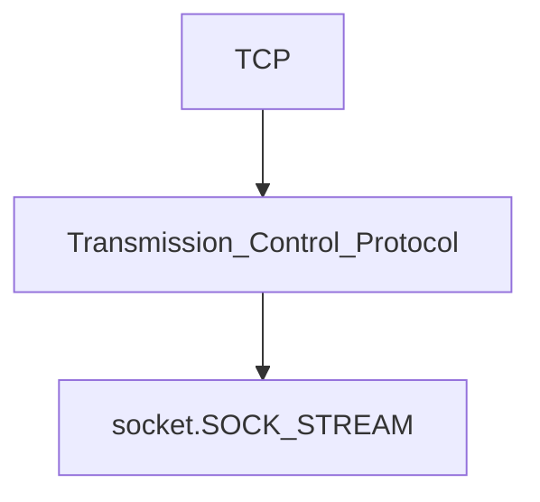
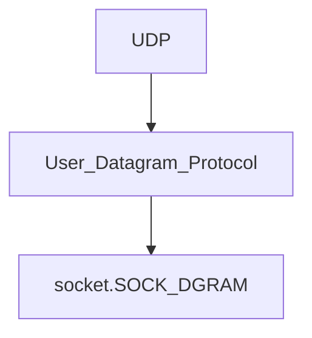

# Sockets in Python:

The primary socket API functions and methods in this module are:

- `socket()`

- `bind()`

- `listen()`

- `accept()`

- `connect()`

- `connect_ex()`

- `send()`

- `recv()`

- `close()`





```python
# Simple Server Example
import socket

HOST = 'localhost'
PORT = 65432

with socket.socket() as s:
    s.bind((HOST, PORT))
    s.listen()
    sock_obj, address_info = s.accept()
    with sock_obj:
        print(f'connected by {address_info}')
        while True:
            data = sock_obj.recv(1024)
            if not data:
                break
            else:
                print(data)
            sock_obj.send(data) 
```

```python
 # Simple Client Example
import socket

HOST = '127.0.0.1'
PORT = 65432

with socket.socket() as s:
    s.connect((HOST, PORT))
    s.send(b"Hello World!")
    data = s.recv(1024)

print(data)
```
