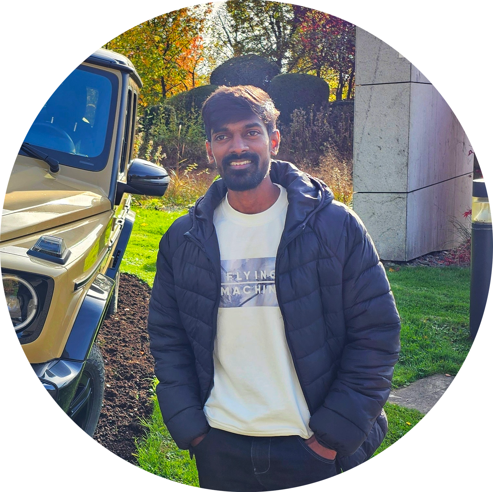

  

# Hi, I'm Jeevan 👨‍💻

I'm a Python developer passionate about automating redundant and boring stuff. 

---

## 🛠️ My Skills

- 🐍 **Languages & Frameworks:** Python, FastAPI, SQLModel, Pytest  
- 🗄️ **Databases:** PostgreSQL, SQLite, SQL, Alembic  
- 🛠️ **DevOps & Tools:** Docker, Docker Compose, GitHub Actions, Postman, Adminer 
- 🔌 **API & Testing:** REST APIs, JIRA REST API, Postman, Pytest  
- 📝 **Documentation:** Markdown, Material for MkDocs  
- 📋 **Project Tools:** JIRA, Confluence, CI/CD  
- 🔐 **Domain Knowledge:** ECU Certificate-based Authentication, Automotive Diagnostics, ODX-D
- 🐍 **Python Libraries:** Pywinauto, FastAPI, PyTorch
- 📦 **Packaging & Build:** setuptools, uv, pyinstaller
- 🧠 **Machine Learning:** PyTorch, COCO, Mask R-CNN
- 🖥️ **UI Testing:** PyWinAuto
- 📘 **Documentation:** MkDocs, Markdown

## 🌐 Socials

- [GitHub](https://github.com/cassini1010)
- [LinkedIn](https://www.linkedin.com/in/jeevan-kumar-15ec070)

---

## 📫 Get in Touch

You can reach me via [email](mailto:jeevan15070@gmail.com
) or open an issue on [GitHub](https://github.com/cassini1010).
